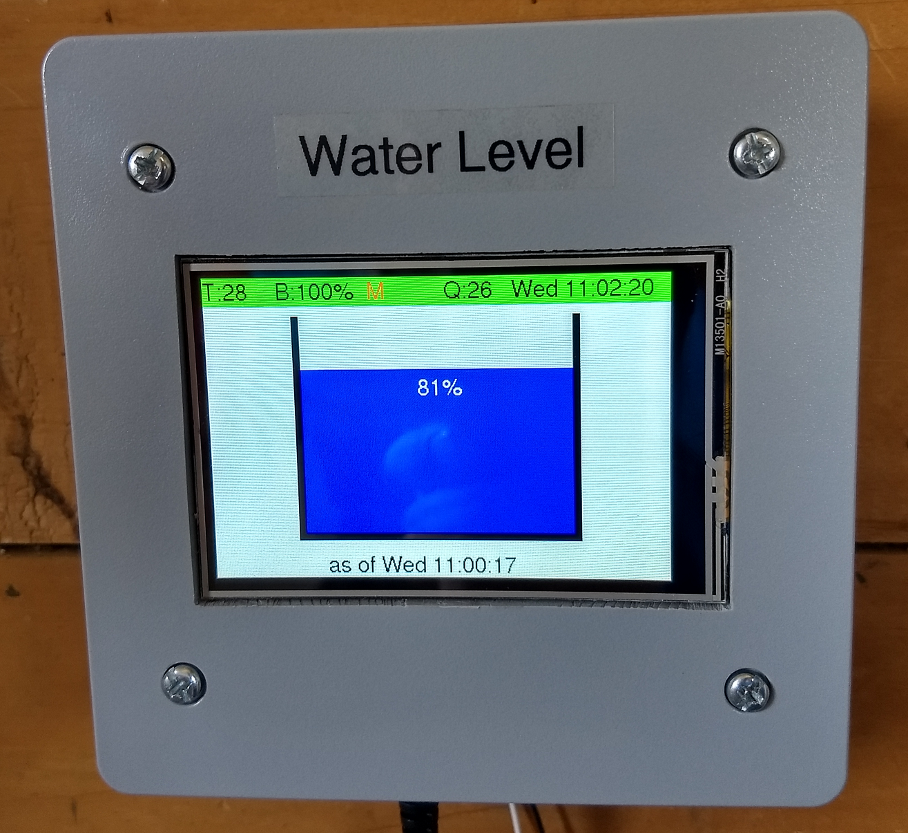

# Water-Tank-Display

Display module for the Water Tank Monitor.

It will be located in the pump house.

From there it will also monitor mains status and the operation of the pump.

It is based on the Adafruit Feather FONA 32u4 cellular module and an Adafruit TFT display.

